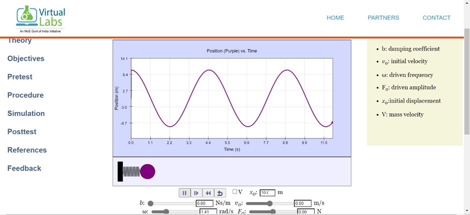
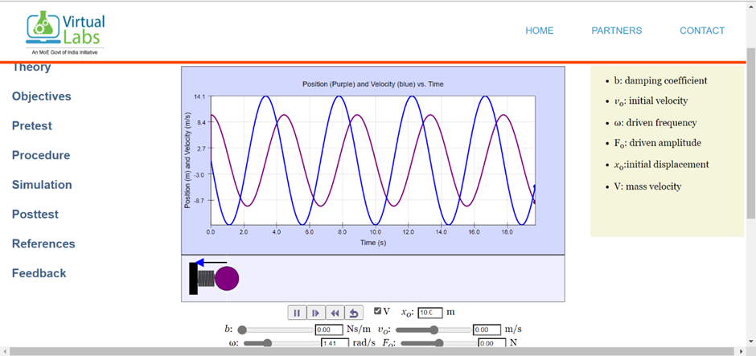

<h3 style="color:#2867B2;">1. To Study Simple Harmonic Motion</h3>
<ul>
  <li>
<strong>Step 1:</strong> Set the damping factor (b) = 0.
</li>
  <li>
<strong>Step 2:</strong> Set v0 = 0 m/s.
</li>
  <li>
<strong>Step 3:</strong> Drag the ball to the maximum starting position, say x0 = 10.0 m, and click the animation button.
</li>
  <li>
<strong>Step 4:</strong> Observe the position graph (Fig. 1) and wait until the animation ends.
</li>
  <li>
<strong>Step 5:</strong> To get the position and velocity graph (Fig. 2), tick the velocity checkbox.
</li>
</ul>

<figure style="display:inline-block; border:1px dashed #aaa; padding:10px; text-align:center; margin:10px 0;">
  
  

    [Fig. 1: SHM position vs time graph &mdash; image will be added to images/procedure_fig1.png]
  

  <figcaption><em>Fig. 1: Graph representing S.H.M. motion (position vs time)</em></figcaption>
</figure>

<figure style="display:inline-block; border:1px dashed #aaa; padding:10px; text-align:center; margin:10px 0;">
  
  

    [Fig. 2: SHM position vs velocity graph &mdash; image will be added to images/procedure_fig2.png]
  

  <figcaption><em>Fig. 2: Graph representing S.H.M. motion (position vs velocity)</em></figcaption>
</figure>

 
<h3 style="color:#2867B2;">2. To Study Damped Oscillatory Motion</h3>
<ul>
  <li>
<strong>Step 1:</strong> Reset the simulation.
</li>
  <li>
<strong>Step 2:</strong> Set v0 = 0 m/sec.
</li>
  <li>
<strong>Step 3:</strong> Change the damping factor (b) (say b = 0.5 or 2.8 or 3).
</li>
  <li>
<strong>Step 4:</strong> Drag the ball to the maximum initial position, say x0 = 10.0 m, and click the play button.
</li>
  <li>
<strong>Step 5:</strong> Perform the experiment for three different values of the damping factor (b = 0.5, 2.8 and 3), resetting the simulation for each case.
</li>
  <li>
<strong>Step 6:</strong> Repeat the entire procedure as done previously.
</li>
</ul>

<em>Note: After selecting any damping checkbox (under-damped, over-damped and critically-damped), there is no need to manually set the value of b.</em>

<ul>
  <li>
    
<strong><u>Case 1: Under-Damping</u></strong>

    
Set the value of b &lt; 2&radic;2 (say b = 0.5)

    <figure style="display:inline-block; border:1px dashed #aaa; padding:10px; text-align:center; margin:10px 0;">
      
      

        [Fig. 3(A): Under-damped simulation screenshot &mdash; image will be added to images/underdamped_sim.png]
      

      <figcaption><em>Fig. 3(A): Under-damped oscillation &mdash; simulation screenshot</em></figcaption>
    </figure>
    <figure style="display:inline-block; border:1px dashed #aaa; padding:10px; text-align:center; margin:10px 0;">
      
      

        [Fig. 3(B): Under-damped position vs time &mdash; image will be added to images/underdamped_pos_graph.png]
      

      <figcaption><em>Fig. 3(B): Graph representing under-damped oscillatory motion (position vs time)</em></figcaption>
    </figure>
    <figure style="display:inline-block; border:1px dashed #aaa; padding:10px; text-align:center; margin:10px 0;">
      
      

        [Fig. 3(C): Under-damped velocity simulation &mdash; image will be added to images/underdamped_vel_sim.png]
      

      <figcaption><em>Fig. 3(C): Under-damped oscillation &mdash; velocity simulation screenshot</em></figcaption>
    </figure>
    <figure style="display:inline-block; border:1px dashed #aaa; padding:10px; text-align:center; margin:10px 0;">
      
      

        [Fig. 3(D): Under-damped position vs velocity &mdash; image will be added to images/underdamped_posvel_graph.png]
      

      <figcaption><em>Fig. 3(D): Graph representing under-damped oscillatory motion (position vs velocity)</em></figcaption>
    </figure>
  </li>

  <li>
    
<strong><u>Case 2: Critical Damping</u></strong>

    
Set the value of b = 2&radic;2 (&approx; 2.8)

    <figure style="display:inline-block; border:1px dashed #aaa; padding:10px; text-align:center; margin:10px 0;">
      
      

        [Fig. 4(A): Critical-damped simulation screenshot &mdash; image will be added to images/criticaldamped_sim.png]
      

      <figcaption><em>Fig. 4(A): Critically damped oscillation &mdash; simulation screenshot</em></figcaption>
    </figure>
    <figure style="display:inline-block; border:1px dashed #aaa; padding:10px; text-align:center; margin:10px 0;">
      
      

        [Fig. 4(B): Critical-damped position vs time &mdash; image will be added to images/criticaldamped_graph1.png]
      

      <figcaption><em>Fig. 4(B): Graph representing critically damped oscillatory motion (position vs time)</em></figcaption>
    </figure>
    <figure style="display:inline-block; border:1px dashed #aaa; padding:10px; text-align:center; margin:10px 0;">
      
      

        [Fig. 4(C): Critical-damped velocity simulation &mdash; image will be added to images/criticaldamped_vel_sim.png]
      

      <figcaption><em>Fig. 4(C): Critically damped oscillation &mdash; velocity simulation screenshot</em></figcaption>
    </figure>
    <figure style="display:inline-block; border:1px dashed #aaa; padding:10px; text-align:center; margin:10px 0;">
      
      

        [Fig. 4(D): Critical-damped position vs velocity &mdash; image will be added to images/criticaldamped_posvel_graph.png]
      

      <figcaption><em>Fig. 4(D): Graph representing critically damped oscillatory motion (position and velocity vs time)</em></figcaption>
    </figure>
  </li>

  <li>
    
<strong><u>Case 3: Over-Damping</u></strong>

    
Set the value of b &gt; 2&radic;2 (for example, b = 3)

    <figure style="display:inline-block; border:1px dashed #aaa; padding:10px; text-align:center; margin:10px 0;">
      
      

        [Fig. 5(A): Over-damped simulation screenshot &mdash; image will be added to images/overdamped_sim.png]
      

      <figcaption><em>Fig. 5(A): Over-damped oscillation &mdash; simulation screenshot</em></figcaption>
    </figure>
    <figure style="display:inline-block; border:1px dashed #aaa; padding:10px; text-align:center; margin:10px 0;">
      
      

        [Fig. 5(B): Over-damped position vs time &mdash; image will be added to images/overdamped_pos_graph.png]
      

      <figcaption><em>Fig. 5(B): Graph representing over-damped oscillatory motion (position vs time)</em></figcaption>
    </figure>
    <figure style="display:inline-block; border:1px dashed #aaa; padding:10px; text-align:center; margin:10px 0;">
      
      

        [Fig. 5(C): Over-damped position and velocity vs time &mdash; image will be added to images/overdamped_posvel_graph.png]
      

      <figcaption><em>Fig. 5(C): Graph representing over-damped oscillatory motion (position and velocity vs time)</em></figcaption>
    </figure>
  </li>
</ul>

In all the above cases, observe the graph and wait until the animation ends.

 
<h3 style="color:#2867B2;">3. To Study Forced Oscillatory Motion</h3>
<ul>
  <li>
<strong>Step 1:</strong> Reset the simulation again.
</li>
  <li>
<strong>Step 2:</strong> Set the damping coefficient (b) &gt; 2&radic;2.
</li>
  <li>
<strong>Step 3:</strong> Change the value of initial velocity v0 = 2 m/sec.
</li>
  <li>
<strong>Step 4:</strong> Set value of driven angular frequency (&omega;) = 1.41.
</li>
  <li>
<strong>Step 5:</strong> Set some values of driven amplitude F0 which will be the force for oscillation.
</li>
  <li>
<strong>Step 6:</strong> Drag the ball to the maximum starting position, say x0 = 10.0 m, and play the animation button.
</li>
  <li>
<strong>Step 7:</strong> Observe the graph until the animation ends.
</li>
</ul>

<figure style="display:inline-block; border:1px dashed #aaa; padding:10px; text-align:center; margin:10px 0;">
  
  

    [Fig. 6(A): Forced oscillatory motion (position vs time) &mdash; image will be added to images/forced_pos_graph.png]
  

  <figcaption><em>Fig. 6(A): Graph representing forced-oscillatory motion (position vs time)</em></figcaption>
</figure>

<figure style="display:inline-block; border:1px dashed #aaa; padding:10px; text-align:center; margin:10px 0;">
  
  

    [Fig. 6(B): Forced oscillatory motion (position and velocity vs time) &mdash; image will be added to images/forced_posvel_graph.png]
  

  <figcaption><em>Fig. 6(B): Graph representing forced-oscillatory motion (position and velocity vs time)</em></figcaption>
</figure>

 
<b>
<u>Perform the following experiments</u>
</b>

<strong>
<u>Experiment 1:</u>
</strong>

Perform an experiment to calculate the value of the spring constant k for the cases described below. In each case, record the observations in the table and compute the value of k. Take the value of m = 1 kg in each case.

<ul type="None">
  <li>
    
<u>Case 1: Free Oscillator (Simple Harmonic Motion) when b = 0</u>

    <ol>
      <li>
Set different values for x0.
</li>
      <li>
Keep other parameters = 0.
</li>
      <li>
Record the value of time period in each case.
</li>
      <li>
Calculate the corresponding angular frequency: &omega; = 2&pi;f
</li>
      <li>
Then compute k (spring constant) using the formula: &omega;0 = &radic;(k/m)
</li>
    </ol>
    <table style="width:80%; border-collapse:collapse;">
      <tr style="background:#dbe9f4;">
        <th style="width:8%; border:1px solid #aaa; padding:6px;">S.No.</th>
        <th style="width:20%; border:1px solid #aaa; padding:6px;">x0 (displacement in m)</th>
        <th style="width:20%; border:1px solid #aaa; padding:6px;">f (frequency in Hz)</th>
        <th style="width:22%; border:1px solid #aaa; padding:6px;">&omega; (angular frequency in rad/s)</th>
      </tr>
      <tr><td style="border:1px solid #aaa; padding:6px;">1.</td><td style="border:1px solid #aaa;"></td><td style="border:1px solid #aaa;"></td><td style="border:1px solid #aaa;"></td></tr>
      <tr><td style="border:1px solid #aaa; padding:6px;">2.</td><td style="border:1px solid #aaa;"></td><td style="border:1px solid #aaa;"></td><td style="border:1px solid #aaa;"></td></tr>
      <tr><td style="border:1px solid #aaa; padding:6px;">3.</td><td style="border:1px solid #aaa;"></td><td style="border:1px solid #aaa;"></td><td style="border:1px solid #aaa;"></td></tr>
      <tr><td style="border:1px solid #aaa; padding:6px;">4.</td><td style="border:1px solid #aaa;"></td><td style="border:1px solid #aaa;"></td><td style="border:1px solid #aaa;"></td></tr>
      <tr><td style="border:1px solid #aaa; padding:6px;">5.</td><td style="border:1px solid #aaa;"></td><td style="border:1px solid #aaa;"></td><td style="border:1px solid #aaa;"></td></tr>
      <tr><td style="border:1px solid #aaa; padding:6px;">6.</td><td style="border:1px solid #aaa;"></td><td style="border:1px solid #aaa;"></td><td style="border:1px solid #aaa;"></td></tr>
    </table>
    
The mean &omega;: _________

    
Computed value of k: _________

  </li>

  <li>
    
<u>Case 2: Under-Damped Oscillator when b &lt; 2&radic;2 (say b = 0.5)</u>

    <ol>
      <li>
Set different values for x0.
</li>
      <li>
Set b &lt; 2&radic;2 and keep other parameters = 0.
</li>
      <li>
Record the value of time period in each case.
</li>
      <li>
Calculate the corresponding angular frequency using:

        

          <strong>&omega; = &radic;( k/m &minus; b2/4m2 )</strong>
        

      </li>
      <li>
Value of b used in the experiment: _________
</li>
    </ol>
    <table style="width:80%; border-collapse:collapse;">
      <tr style="background:#dbe9f4;">
        <th style="width:8%; border:1px solid #aaa; padding:6px;">S.No.</th>
        <th style="width:20%; border:1px solid #aaa; padding:6px;">x0 (displacement in m)</th>
        <th style="width:20%; border:1px solid #aaa; padding:6px;">f (frequency in Hz)</th>
        <th style="width:22%; border:1px solid #aaa; padding:6px;">&omega; (angular frequency in rad/s)</th>
      </tr>
      <tr><td style="border:1px solid #aaa; padding:6px;">1.</td><td style="border:1px solid #aaa;"></td><td style="border:1px solid #aaa;"></td><td style="border:1px solid #aaa;"></td></tr>
      <tr><td style="border:1px solid #aaa; padding:6px;">2.</td><td style="border:1px solid #aaa;"></td><td style="border:1px solid #aaa;"></td><td style="border:1px solid #aaa;"></td></tr>
      <tr><td style="border:1px solid #aaa; padding:6px;">3.</td><td style="border:1px solid #aaa;"></td><td style="border:1px solid #aaa;"></td><td style="border:1px solid #aaa;"></td></tr>
      <tr><td style="border:1px solid #aaa; padding:6px;">4.</td><td style="border:1px solid #aaa;"></td><td style="border:1px solid #aaa;"></td><td style="border:1px solid #aaa;"></td></tr>
      <tr><td style="border:1px solid #aaa; padding:6px;">5.</td><td style="border:1px solid #aaa;"></td><td style="border:1px solid #aaa;"></td><td style="border:1px solid #aaa;"></td></tr>
      <tr><td style="border:1px solid #aaa; padding:6px;">6.</td><td style="border:1px solid #aaa;"></td><td style="border:1px solid #aaa;"></td><td style="border:1px solid #aaa;"></td></tr>
    </table>
    
The mean &omega; = ________

    
Computed value of k = _____________

  </li>

  <li>
    
<u>Case 3: Forced Oscillator when b &gt; 2&radic;2</u>

    <ol>
      <li>
Set different values of F0.
</li>
      <li>
Set driven angular frequency &omega;0 = 1 rad/sec.
</li>
      <li>
Obtain the value of amplitude by observing the graph each time.
</li>
      <li>
Obtain the value of &omega; using the relation:

        

          <strong>A = F0 / ( m &radic;[ (&omega;2 &minus; &omega;02)2 + 4&gamma;2m2 ] )</strong>
        

      </li>
      <li>
Then compute k (spring constant) from the calculated mean value.
</li>
    </ol>
    <table style="width:80%; border-collapse:collapse;">
      <tr style="background:#dbe9f4;">
        <th style="width:8%; border:1px solid #aaa; padding:6px;">S.No.</th>
        <th style="width:18%; border:1px solid #aaa; padding:6px;">F0 (force in N)</th>
        <th style="width:18%; border:1px solid #aaa; padding:6px;">A (amplitude in m)</th>
        <th style="width:22%; border:1px solid #aaa; padding:6px;">&omega; (angular frequency in rad/s)</th>
      </tr>
      <tr><td style="border:1px solid #aaa; padding:6px;">1.</td><td style="border:1px solid #aaa;"></td><td style="border:1px solid #aaa;"></td><td style="border:1px solid #aaa;"></td></tr>
      <tr><td style="border:1px solid #aaa; padding:6px;">2.</td><td style="border:1px solid #aaa;"></td><td style="border:1px solid #aaa;"></td><td style="border:1px solid #aaa;"></td></tr>
      <tr><td style="border:1px solid #aaa; padding:6px;">3.</td><td style="border:1px solid #aaa;"></td><td style="border:1px solid #aaa;"></td><td style="border:1px solid #aaa;"></td></tr>
      <tr><td style="border:1px solid #aaa; padding:6px;">4.</td><td style="border:1px solid #aaa;"></td><td style="border:1px solid #aaa;"></td><td style="border:1px solid #aaa;"></td></tr>
      <tr><td style="border:1px solid #aaa; padding:6px;">5.</td><td style="border:1px solid #aaa;"></td><td style="border:1px solid #aaa;"></td><td style="border:1px solid #aaa;"></td></tr>
      <tr><td style="border:1px solid #aaa; padding:6px;">6.</td><td style="border:1px solid #aaa;"></td><td style="border:1px solid #aaa;"></td><td style="border:1px solid #aaa;"></td></tr>
    </table>
    
The mean &omega; = ________

    
Computed value of k = _____________

  </li>
</ul>
