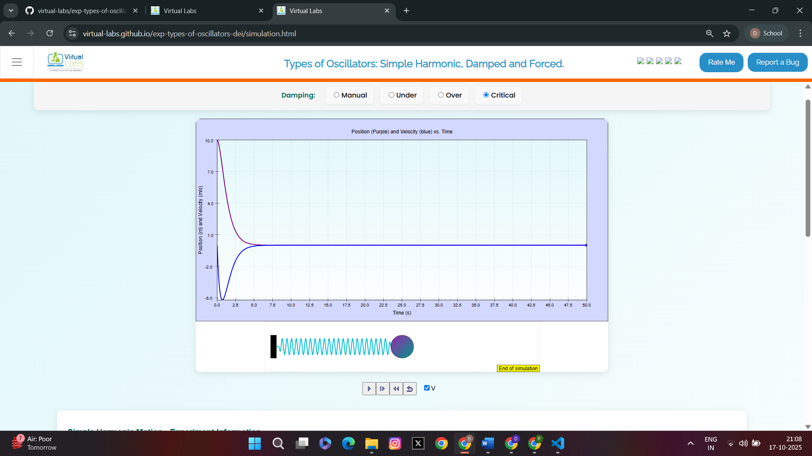
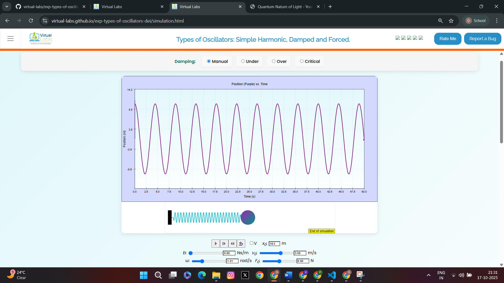

<u>Procedure for the experiment is as follows:</u>

1.To study the Simple harmonic motion
<ul>
<li> 
step1: Read the theory 
 </li>
<li> 
step2: Set the damping factor (b) = 0 
</li>
<li> 
step3: set vo= 0 m/s
</li> 
<li> 
step4: Drag the ball to maximum starting position say xo= 10.0m and play the animation button.
</li>
<li> 
step5: Observe the graph,wait until  the animation ends
</li>	
<u style="color:darkblue;">
Graph representing S.H.M motion (position graph)
</u>

<u style="color:darkblue;">

Graph representing S.H.M motion (position and velocity graph)

</u>

</ul>
 
<strong>
2.To study Damped oscillatory motion
</strong>
<ul>
<li>
step1: Reset the simulation
</li>
<li>
step2: Set vo= 0 m/sec 
</li>
<li>
step3: change the damping factor(b) from 0 to some value take three cases and reset the simulation in each case
</li>
<ul >
<li>
Case 1:<u>Under-Damping</u>
</li>

Set the value of b < 2√2 (say b= 0.5) 

<u style="color:darkblue;">
Graph representing under-damped oscillatory  motion (position graph)
</u>

<u style="color:darkblue;">
Graph representing under-damped oscillatory motion (position and velocity graph)
</u>

<li>
Case 2: <u>Critical-Damping</u>
</li>

Set the value of b = 2√2  

<u style="color:darkblue;">
Graph representing critical-damped oscillatory motion (position graph)
</u>

<u style="color:darkblue;">
Graph representing critical-damped oscillatory motion (position and velocity graph)
</u>

<li>
Case 3: <u>Over-Damping</u>
</li>

Set the value of b > 2√2 (say b= 3) 

<u style="color:darkblue;">
Graph representing over-damped oscillatory motion (position graph)
</u>

<u style="color:darkblue;">
Graph representing over-damped oscillatory motion (position and velocity graph)
</u>
</ul>
<li>
step4: Drag the ball to maximum starting position say xo= 10.0m  and play the animation button.
</li>
<li>
step5: In all the above three cases mentioned observe the graph and wait till animation ends.
</li>
</ul>
 					
<strong>
3.To study Forced oscillatory motion
</strong>
<ul>
<li> 
step1: Reset the simulation again 
 </li>
<li> 
step2: Set the damping coefficient (b) > 2√2 
</li>
<li> 
step3: Change the value of initial velocity vo= 2m/sec
</li> 
<li> 
step4: Set value of driven frequency(ω) = 1.41
</li>
<li> 
step5: Set some value of driven amplitude Fo which will be the force for oscillation
</li>
<li> 
step6: Drag the ball to maximum starting position say xo= 10.0m  and play the animation button.
</li>
<li> 
step7: Observe the graph till the animation ends
</li>
<u style="color:darkblue;">
Graph representing forced-oscillatory motion (position graph)
</u>

<u style="color:darkblue;">
Graph representing forced-oscillatory motion (position and velocity graph)
</u>

</ul>
 
<b>
<u> Perform the following experiments</u>
</b>

<strong>
<u>Experiment-1:</u> 
</strong>

	Perform experiment to calculate the value of k (spring constant) in the following cases described below.In each case record observations into the table and compute the value of k.Take value of m =1 kg in each case.

<ul type="None">
<li>
<u>Case 1:</u> Free oscillator (simple harmonic motion) when b = 0
</li>
<ol>
<li>
set different values for xo
</li>
<li>
 keep other parameters = 0
</li>
<li>
record the value of time in each case
</li>
<li>
calculate corrosponding angular frequency
</li>
<li>
then compute k (spring constant) using formula   
 
</li>
<table style="width:80%">
<tr>
<th style="width:1%" >S.no</th>
<th style="width:12%">xo (displacement)</th>
<th style="width:5%">f (frequency)</th>
<th style="width:18%">ω (angular frequency)</th>
</tr>
<tr>
<th>1.</th>
<th></th>
<th></th>
<th></th>
</tr>
<tr>
<th>2.</th>
<th></th>
<th></th>
<th></th>
</tr>
<tr>
<th>3.</th>
<th></th>
<th></th>
<th></th>
</tr>
<tr>
<th>4.</th>
<th></th>
<th></th>
<th></th>
</tr>
<tr>
<th>5.</th>
<th></th>
<th></th>
<th></th>
</tr>
<tr>
<th>6.</th>
<th></th>
<th></th>
<th></th>
</tr>
</table>
<ul type="None">

 The mean ω: _________ 
</li>
<li>
Computed value of k:__________
</li></ul>
</ol>
 
<li>
<u>Case 2:</u>Under-Damped damped Oscillator when b < 2√2 
</li>
<ol >
<li>
set different values for xo
</li>
<li>
set b<2√2</b> and keep other parameters = 0 
</li>
<li>
record the value of time in each case
</li>
<li>
calculate corrosponding angular frequency:

 
</li>
<li>
 Value of b used in the experiment:_________
</li></ul>
 
<table style="width:80%">
<tr>
<th style="width:1%" text-align="center;">S.no</th>
<th style="width:13%">xo (displacement)</th>
<th style="width:5%">f (frequency)</th>
<th style="width:18%"> ω (angular frequency)</th>
</tr>
<tr>
<th>1.</th>
<th></th>
<th></th>
<th></th>
</tr>
<tr>
<th>2.</th>
<th></th>
<th></th>
<th></th>
</tr>
<tr>
<th>3.</th>
<th></th>
<th></th>
<th></th>
</tr>
<tr>
<th>4.</th>
<th></th>
<th></th>
<th></th>
</tr>
<tr>
<th>5.</th>
<th></th>
<th></th>
<th></th>
</tr>
<tr>
<th>6.</th>
<th></th>
<th></th>
<th></th>
</tr>
</table>
<ul type="None">
<li>
The mean  = ________
</li>
<li>
 computed value of k=_____________
</li></ul>
</ol>
 
<li>
<u>Case 3:</u> Forced oscillator when b > 2√2 
</li>
<ol>
<li>
set different values for Fo
</li>
<li>
 set driven frequency ω =1rad/sec, 
</li>
<li>
 obtain the value of amplitude by observing graph each time.
</li>
<li>
obtain the value of ω using the relation:

<li>
then compute k (spring constant) from the calculated mean value of 
</li> 
<table style="width:80%">
<tr>
<th style="width:2%" text-align="center;">S.no</th>
<th style="width:10%">Fo (force)</th>
<th style="width:5%"> A (amplitude)</th>
<th style="width:10%">ω (angular frequency)</th>
</tr>
<tr>
<th>1.</th>
<th></th>
<th></th>
<th></th>
</tr>
<tr>
<th>2.</th>
<th></th>
<th></th>
<th></th>
</tr>
<tr>
<th>3.</th>
<th></th>
<th></th>
<th></th>
</tr>
<tr>
<th>4.</th>
<th></th>
<th></th>
<th></th>
</tr>
<tr>
<th>5.</th>
<th></th>
<th></th>
<th></th>
</tr>
<tr>
<th>6.</th>
<th></th>
<th></th>
<th></th>
</tr>
</table>
<ul type="None">
<li>
The mean ω = ________
</li>
<li>
 computed value of k =_____________
</li></ul>
</ol>
</ul>			

