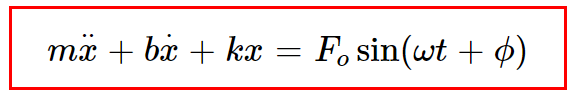
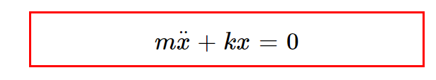
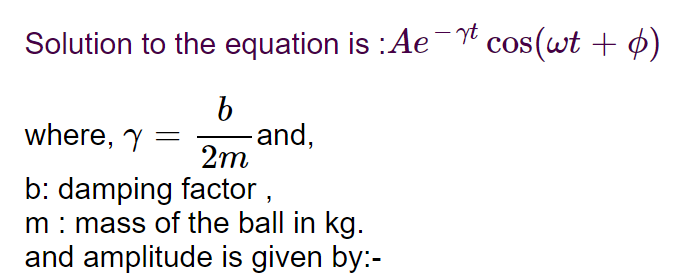
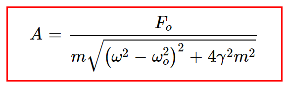
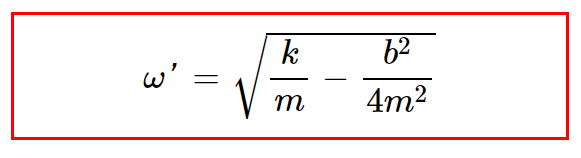
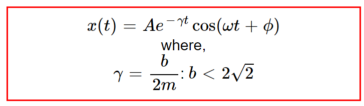
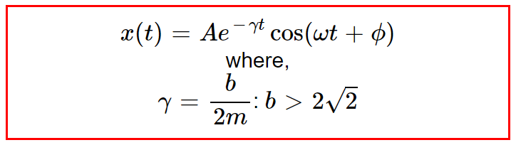
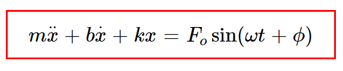

 
<h3>Simple Harmonic Motion</h3> 

Simple harmonic motion (SHM) is a type of oscillating motion. When there is a slight disturbance from their equilibrium or rest position, it will oscillate with harmonically This is the most fundamental vibration of a single particle or one-dimensional system. A small displacement x from its equilibrium position sets up a restoring force That is proportional to x acting in a direction towards the equilibrium position.

F = -kx 

It is used to model many situations in real life where a mass oscillates about an equilibrium point.
<ol class="examples">
<li>Simple Pendulum</li>

 It is a simple pendulum, a mass m swinging at the end of a light rigid rod of length 'l'.

<!--  -->
<li>Mass attached to the spring</li>

A mass fixed to a wall via a spring of stiffness s sliding to and fro in the `x` direction on a frictionless plane.

<!--  -->
 
<!--   -->
<li>U-Tube example using SHM motion</li>

The Motion of an oscillating liquid column in a U tube is SHM with period T = 2πgh, where h is the height of the liquid column in one arm of U tube in equilibrium position of the liquid.

Therefore, T is independent of the density of liquid.

<li>LC Oscillator</li>

It is an electrical circuit, an inductance L connected across a capacitance C carrying a charge q.

</ol>

The governing equation for the motion is:
 
 
<ul style="None">
<li>m: mass of the ball in kg, m = 1 kg </li> 
<li>b: damping factor in (Ns/m)</li> 
<li>k : spring constant in N/m</li> 
<li>Fo: Force in Newton (N)</li> 
<li>ω: driven frequency in rad/sec</li> 
<li>t: time period</li> 
<li>φ: phase angle</li> 
</ul>

<h2><u>Free Oscillators</u> </h2>
<ul type="None">
<li>
Free oscillations occur when the motion is maintained by gravitational or elastic restoring forces, such as the swinging motion of a pendulum or the vibration of an elastic rod. The simplest type of vibrating motion is undamped free vibration.
</li>
 
<li>
 Some examples of free oscillations are oscillations of simple pendulums, oscillations of objects connected to a horizontal spring, sound produced by tuning forks in short distances, notes of musical instruments, organ pipes, etc.
 </li>

<strong>Example:</strong>  Horizontal spring mass system, tuning fork
	
<li>
<u><strong>Nature of free oscillations</strong></u>  
Amplitude and frequency of a freely vibrating body remain constant. They do not lose or gain any energy in the process. Free vibrations for sound can occur only in a vacuum. Such vibrations are ideal conditions of oscillations. It is not possible to practically realize free oscillations.
</li>
<li>
 In this type of motion Fo, b (damping factor) = 0  So the equation(1) is : 
 

 where, 

<li>
•	The solution of the equation is: Acos(ωt+φ)  which represents simple harmonic motion 
</li>
<li>
<strong>

ωo is the natural frequency of the system:
 

 </li></strong>
</ul>
  

<h2><u>Damped Oscillators</u> </h2>
<ul type="None">
<li>
A damped oscillation is one in which the moving particle gradually loses its kinetic energy on interaction with resistive forces like air or friction. Due to this resistance offered by external forces, the displacement of a particle slowly reduces with time and ultimately reaches its state of rest. </li>

</li>
<li>
<strong>Example:</strong>A simple pendulum oscillating under natural conditions. Shock absorbers in vehicles are an example of damping devices that reduce the vehicle’s vibrations.
</li>

 Shock Absorbers
	

If the damping force Fo ,is proportional to the velocity vo, with a damping constant b, then 

Fo = -b𝑣o
The equation of motion (1) becomes:

									

 ωo is natural frequency of the damped system and  ω' is the frequency of the damped oscillator. 

 b2 = 4km  
b =  2√2							

Under certain conditions damping is of three types:-

<strong><u>
1.Under Damping
</u></strong>

When damping is small, the system vibrates at first approximately as if there were no damping, but the amplitude of the solutions decreases exponentially. 
<strong>Example :</strong> a swinging pendulum decreasing in amplitude until it comes to a stop. 

<u>Under damped oscillations:</u> b < 2√2
   

  				
b: damping factor , 
m : mass of the ball in kg. 
and amplitude is given by:-

  
<strong><u>
2.Critical Damping
</u></strong>

When a critically damped oscillator is displaced from the equilibrium, it will return to rest at its equilibrium position in the shortest possible time without oscillating. Critical damping occurs when the position of the mass will asymptotically approach 0. Depending on the initial velocity, it will either go monotonically to zero or reach some maximum displacement before it turns around and goes to 0.  
<strong>Example: </strong>car suspension systems prevent the car from oscillating after travelling over a bump in the road. <u>
Critically damped oscillations:</u> b = 2.8  
 
<!-- 

   -->
<strong><u>
3.Over Damping
</u></strong>

When a heavily damped oscillator is displaced from the equilibrium, it will take a long time to return to its equilibrium position without oscillating. When damping is that large, the system does not oscillate at all. 
<strong>Example:</strong>car suspension systems prevent the car from oscillating after travelling over a bump in the road 
<u>
Over damped oscillations:</u> b > 2.8 

  
</ul>
<h2><u>Forced Oscillators</u> </h2>
<ul type="None">
<li>
Forced oscillations occur when an oscillating system is driven by a periodic force that is external to the oscillating system.
</li>
<li>
<strong><u>Example:-</u></strong>Applying force for movement of a pendulum turning of a radio 
 
</li>

The equation is: 

<li>

</li>
<li>
here  ω: driven frequency for forced oscillations.  Fo:force for the forced oscillator
</li>
<li><u><strong>
Resonance
</strong></u> 

If the forcing frequency is close to the natural frequency of the system, and the system is lightly damped, huge vibration amplitudes may occur. This phenomenon is known as resonance. 
</li></li>
<li> 

1. musical instruments (acoustic resonance).  
2. Most clocks keep time by mechanical resonance in a balance wheel, pendulum, or quartz crystal. 
3. Tidal resonance of the Bay of Fundy.    
4. Orbital resonance as in some moons of the solar system's gas giants.     
5. The resonance of the basilar membrane in the ear. 
6. Making a child's swing higher by pushing it at each swing.     
7. A wineglass breaking when someone sings a loud note at exactly the right pitch.
 
</li>

 <h3> <u>
Additional Information:
</u></h3>

<li> 
There are some other types of oscillations, such as:
</li>

<h3> <u><strong>
 Coupled Oscillators
</strong></u> </h3> 

Coupled oscillations occur when two or more oscillating systems are connected in such a manner as to allow motion energy to be exchanged between them. Coupled oscillators occur in nature (e.g., the moon and earth orbiting each other) or can be found in man-made devices (such as with the pacemaker).
