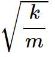
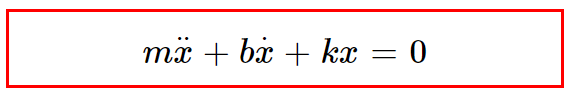

# Free Oscillators

Free oscillations occur when the motion is maintained by gravitational or elastic restoring forces, such as the swinging motion of a pendulum or the vibration of an elastic rod.  
The simplest type of vibrating motion is **undamped free vibration**.

---

## Examples
- Oscillations of simple pendulums  
- Oscillations of objects connected to a horizontal spring  
- Sound produced by tuning forks in short distances  
- Notes of musical instruments, organ pipes, etc.

**Example:** Horizontal spring mass system, tuning fork

---

## Nature of Free Oscillations
- Amplitude and frequency of a freely vibrating body remain constant.  
- They do not lose or gain any energy in the process.  
- Free vibrations for sound can occur only in a vacuum.  
- Such vibrations are ideal conditions of oscillations, practically not realizable.

---

**In this type of motion:**  
\(F_o = 0\), \(b = 0\) (damping factor)

So the equation is:  

**Solution:** \(A \cos(\omega t + \phi)\) — represents simple harmonic motion.

---

**Natural Frequency:**

---

# Simple Harmonic Motion (SHM)

Simple harmonic motion is a type of oscillating motion.  
When there is a slight disturbance from the equilibrium position, the system oscillates harmonically.  
It is the most fundamental vibration of a single particle or one-dimensional system.

A small displacement \(x\) from equilibrium sets up a restoring force proportional to \(x\), acting towards equilibrium:

\[
F = -kx
\]

SHM is used to model situations where a mass oscillates about an equilibrium point.

---

## Examples of SHM

1. **Simple Pendulum**  
   A mass *m* swinging at the end of a light rigid rod of length \(l\).

2. **Mass Attached to a Spring**  
   A mass fixed to a wall via a spring of stiffness *s*, sliding in the x-direction on a frictionless plane.

3. **U-Tube**  
   Motion of an oscillating liquid column in a U-tube:  
   \[
   T = 2\pi\sqrt{\frac{l}{g}}
   \]
   where \(h\) is the height of the liquid column in one arm.

4. **LC Oscillator**  
   An inductance *L* connected across a capacitance *C* carrying a charge *q*.

---

**Governing Equation:**

**Parameters:**
- *m*: mass (kg)
- *b*: damping factor (Ns/m)
- *k*: spring constant (N/m)
- \(F_o\): Force (N)
- \(\omega\): driven frequency (rad/sec)
- *t*: time period
- \(\phi\): phase angle

---

# Damped Oscillators

A damped oscillation occurs when the moving particle gradually loses kinetic energy due to resistive forces (air resistance, friction).  
The displacement slowly reduces with time until rest.

---

**Example:**  
- A simple pendulum oscillating under natural conditions  
- Shock absorbers in vehicles

---

## Shock Absorbers

If damping force \(F_o\) is proportional to velocity \(v_o\) with damping constant *b*:

\[
F_o = -b v_o
\]

Equation of motion becomes:  

Natural frequency of damped system:  

Where:  
\(b^2 = 4km\)  
\(b = 2\sqrt{2}\)

---

## Types of Damping

### 1. Under Damping
- Small damping; system vibrates with decreasing amplitude.
- **Example:** Swinging pendulum slowing down.
- Condition: \(b < 2\sqrt{2}\)

Amplitude:  

---

### 2. Critical Damping
- System returns to equilibrium in the shortest time without oscillating.
- **Example:** Car suspension system after a bump.
- Condition: \(b = 2.8\)

---

### 3. Over Damping
- Large damping; slow return to equilibrium without oscillations.
- **Example:** Car suspension with excessive damping.
- Condition: \(b > 2.8\)

---

# Forced Oscillators

Forced oscillations occur when an oscillating system is driven by an **external periodic force**.

**Example:** Applying force to keep a pendulum swinging.

---

**Equation:**

Where:  
- \(\omega\): driven frequency  
- \(F_o\): force for forced oscillation

---

## Resonance

When forcing frequency is close to natural frequency and damping is small, **large amplitudes** occur — this is **resonance**.

**Examples:**
1. Musical instruments (acoustic resonance)
2. Clocks (balance wheel, pendulum, quartz crystal)
3. Tidal resonance (Bay of Fundy)
4. Orbital resonance (moons of gas giants)
5. Basilar membrane in the ear
6. Swinging a child's swing at the right frequency
7. Breaking a wineglass with a matching pitch

---

## 
 Additional Information

There are some other types of oscillations such as :
## Coupled Oscillators
Coupled oscillations occur when two or more oscillating systems are connected in such a manner as to allow motion energy to be exchanged between them. Coupled oscillators occur in nature (e.g., the moon and earth orbiting each other) or can be found in man-made devices (such as with the pacemaker).

---
