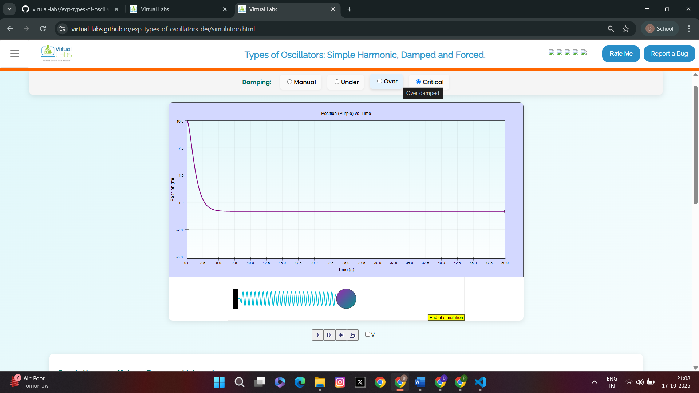

<u><strong>Procedure for the experiment is as follows:</strong></u>

<strong>
1. To study Simple Harmonic Motion
</strong>
<ul>
<li>
Step 1: Set the damping factor (b) = 0.
</li>
<li>
Step 2: Set v0 = 0 m/s.
</li>
<li>
Step 3: Drag the ball to the maximum starting position, say x0 = 10.0 m, and click the play animation button.
</li>
<li>
Step 4: Observe the position graph as shown in Fig. 1 and wait until the animation ends.
</li>
<li>
Step 5: To get the position and velocity graph as shown in Fig. 2, tick the velocity checkbox (V).
</li>
</ul>

<u style="color:darkblue;">
Fig. 1: Graph representing S.H.M. motion (position vs time)
</u>

<u style="color:darkblue;">
Fig. 2: Graph representing S.H.M. motion (position and velocity vs time)
</u>

 

<strong>
2. To study Damped Oscillatory Motion
</strong>
<ul>
<li>
Step 1: Reset the simulation.
</li>
<li>
Step 2: Set v0 = 0 m/sec.
</li>
<li>
Step 3: Change the damping factor (b) (for example, b = 0.5, 2.83 or 3).
</li>
<li>
Step 4: Drag the ball to the maximum initial position, say x0 = 10.0 m and click the play button.
</li>
<li>
Step 5: Perform the experiment for three different values of the damping factor (b = 0.5, 2.83 and 3), resetting the simulation for each case.
</li>
<li>
Step 6: Repeat the entire procedure as done previously.
</li>
</ul>

<strong>Note:</strong> After selecting any damping checkbox (Under, Over, or Critical), the value of <b>b</b> is automatically set &mdash; no need to manually enter it.

<ul>
<li>
<u>Case 1: Under-Damping</u>
</li>

Set the value of b &lt; 2&radic;2 (say b = 0.5)

<u style="color:darkblue;">
Fig. 3: Graph representing under-damped oscillatory motion (position vs time)
</u>

<u style="color:darkblue;">
Fig. 4: Graph representing under-damped oscillatory motion (position and velocity vs time)
</u>

<li>
<u>Case 2: Critical-Damping</u>
</li>

Set the value of b = 2&radic;2 &asymp; 2.83

<u style="color:darkblue;">
Fig. 5: Graph representing critically-damped oscillatory motion (position vs time)
</u>

<u style="color:darkblue;">
Fig. 6: Graph representing critically-damped oscillatory motion (position and velocity vs time)
</u>

<li>
<u>Case 3: Over-Damping</u>
</li>

Set the value of b &gt; 2&radic;2 (say b = 3)

<u style="color:darkblue;">
Fig. 7: Graph representing over-damped oscillatory motion (position vs time)
</u>

<u style="color:darkblue;">
Fig. 8: Graph representing over-damped oscillatory motion (position and velocity vs time)
</u>

</ul>

In all the above cases, observe the graph and wait until the animation ends.

 

<strong>
3. To study Forced Oscillatory Motion
</strong>
<ul>
<li>
Step 1: Reset the simulation again.
</li>
<li>
Step 2: Set the damping coefficient (b) &gt; 2&radic;2 (say b = 3).
</li>
<li>
Step 3: Change the value of initial velocity v0 = 2 m/sec.
</li>
<li>
Step 4: Set value of driven angular frequency (&omega;) = 1.41 rad/s.
</li>
<li>
Step 5: Set some value of driven amplitude F0 which will be the force for oscillation.
</li>
<li>
Step 6: Drag the ball to the maximum starting position, say x0 = 10.0 m and press the play button.
</li>
<li>
Step 7: Observe the graph till the animation ends.
</li>
</ul>

<u style="color:darkblue;">
Fig. 9: Graph representing forced-oscillatory motion (position vs time)
</u>

<u style="color:darkblue;">
Fig. 10: Graph representing forced-oscillatory motion (position and velocity vs time)
</u>

 

<b>
<u>Perform the following experiments</u>
</b>

<strong>Experiment 1:</strong>

Perform an experiment to calculate the value of <b>k</b> (spring constant) for the cases described below. In each case, record the observations in the table and compute the value of k. Take the value of <b>m = 1 kg</b> in each case.

<!-- ================= CASE 1: Free Oscillator ================= -->

<u>Case 1:</u> Free oscillator (Simple Harmonic Motion) when <b>b = 0</b>

<ol>
<li>
Set different values for x0.
</li>
<li>
Keep other parameters = 0.
</li>
<li>
Record the value of time period (T) in each case.
</li>
<li>
Calculate the corresponding angular frequency &omega; = 2&pi;/T.
</li>
<li>
Then compute k (spring constant) using the formula:  
 
&omega; = &radic;(k/m) &rArr; k = m&omega;&sup2;
</li>
</ol>

<b>Table 1: Test values for Free Oscillator (b = 0, v0 = 0, m = 1 kg)</b>

<table style="width:80%; border-collapse: collapse; text-align: center;" border="1" cellpadding="8">
<tr style="background-color:#e0f2f1;">
<th style="width:5%">S.No</th>
<th style="width:15%">x0 (m)</th>
<th style="width:15%">T (s)</th>
<th style="width:15%">f (Hz)</th>
<th style="width:20%">&omega; (rad/s)</th>
</tr>
<tr>
<td>1</td>
<td>1.0</td>
<td>4.44</td>
<td>0.225</td>
<td>1.414</td>
</tr>
<tr>
<td>2</td>
<td>2.0</td>
<td>4.44</td>
<td>0.225</td>
<td>1.414</td>
</tr>
<tr>
<td>3</td>
<td>4.0</td>
<td>4.44</td>
<td>0.225</td>
<td>1.414</td>
</tr>
<tr>
<td>4</td>
<td>6.0</td>
<td>4.44</td>
<td>0.225</td>
<td>1.414</td>
</tr>
<tr>
<td>5</td>
<td>8.0</td>
<td>4.44</td>
<td>0.225</td>
<td>1.414</td>
</tr>
<tr>
<td>6</td>
<td>10.0</td>
<td>4.44</td>
<td>0.225</td>
<td>1.414</td>
</tr>
</table>

The mean &omega; = <b>1.414 rad/s</b>

Computed value of k = m&omega;&sup2; = 1 &times; (1.414)&sup2; = <b>2.0 N/m</b>

 

<!-- ================= CASE 2: Under-Damped Oscillator ================= -->

<u>Case 2:</u> Under-Damped Oscillator when <b>b &lt; 2&radic;2</b> (say b = 0.5)

<ol>
<li>
Set different values for x0.
</li>
<li>
Set b = 0.5 Ns/m and keep other parameters = 0.
</li>
<li>
Record the value of time period (T) in each case.
</li>
<li>
Calculate the corresponding damped angular frequency:

 
&omega;d = &radic;(k/m &minus; b&sup2;/(4m&sup2;))
</li>
</ol>

<b>Value of b used in the experiment: 0.5 Ns/m</b>

<b>Table 2: Test values for Under-Damped Oscillator (b = 0.5, v0 = 0, m = 1 kg)</b>

<table style="width:80%; border-collapse: collapse; text-align: center;" border="1" cellpadding="8">
<tr style="background-color:#e0f2f1;">
<th style="width:5%">S.No</th>
<th style="width:15%">x0 (m)</th>
<th style="width:15%">T (s)</th>
<th style="width:15%">f (Hz)</th>
<th style="width:20%">&omega;d (rad/s)</th>
</tr>
<tr>
<td>1</td>
<td>1.0</td>
<td>4.51</td>
<td>0.222</td>
<td>1.392</td>
</tr>
<tr>
<td>2</td>
<td>2.0</td>
<td>4.51</td>
<td>0.222</td>
<td>1.392</td>
</tr>
<tr>
<td>3</td>
<td>4.0</td>
<td>4.51</td>
<td>0.222</td>
<td>1.392</td>
</tr>
<tr>
<td>4</td>
<td>6.0</td>
<td>4.51</td>
<td>0.222</td>
<td>1.392</td>
</tr>
<tr>
<td>5</td>
<td>8.0</td>
<td>4.51</td>
<td>0.222</td>
<td>1.392</td>
</tr>
<tr>
<td>6</td>
<td>10.0</td>
<td>4.51</td>
<td>0.222</td>
<td>1.392</td>
</tr>
</table>

The mean &omega;d = <b>1.392 rad/s</b>

Computed value of k = m(&omega;d&sup2; + b&sup2;/(4m&sup2;)) = 1 &times; (1.9375 + 0.0625) = <b>2.0 N/m</b>

 

<!-- ================= CASE 3: Forced Oscillator ================= -->

<u>Case 3:</u> Forced oscillator when <b>b &gt; 2&radic;2</b> (say b = 3)

<ol>
<li>
Set different values for F0.
</li>
<li>
Set driven angular frequency &omega; = 1.41 rad/s.
</li>
<li>
Obtain the value of steady-state amplitude (A) by observing the graph each time.
</li>
<li>
Obtain the value of natural frequency &omega;0 using the relation:

 
A = F0 / &radic;((k &minus; m&omega;&sup2;)&sup2; + b&sup2;&omega;&sup2;)
</li>
<li>
Then compute k (spring constant) from the calculated mean value of &omega;0.
</li>
</ol>

<b>Parameters: b = 3 Ns/m, &omega;drive = 1.41 rad/s, x0 = 10 m, v0 = 2 m/s</b>

<b>Table 3: Test values for Forced Oscillator (b = 3, &omega; = 1.41 rad/s, m = 1 kg)</b>

<table style="width:80%; border-collapse: collapse; text-align: center;" border="1" cellpadding="8">
<tr style="background-color:#e0f2f1;">
<th style="width:5%; text-align: center;">S.No</th>
<th style="width:12%; text-align: center;">F0 (N)</th>
<th style="width:15%; text-align: center;">A (m)</th>
<th style="width:20%; text-align: center;">&omega;0 (rad/s)</th>
</tr>
<tr>
<td>1</td>
<td>1.0</td>
<td>0.236</td>
<td>1.414</td>
</tr>
<tr>
<td>2</td>
<td>2.0</td>
<td>0.473</td>
<td>1.414</td>
</tr>
<tr>
<td>3</td>
<td>3.0</td>
<td>0.709</td>
<td>1.414</td>
</tr>
<tr>
<td>4</td>
<td>5.0</td>
<td>1.182</td>
<td>1.414</td>
</tr>
<tr>
<td>5</td>
<td>8.0</td>
<td>1.891</td>
<td>1.414</td>
</tr>
<tr>
<td>6</td>
<td>10.0</td>
<td>2.364</td>
<td>1.414</td>
</tr>
</table>

The mean &omega;0 = <b>1.414 rad/s</b>

Computed value of k = m&omega;0&sup2; = 1 &times; (1.414)&sup2; = <b>2.0 N/m</b>

